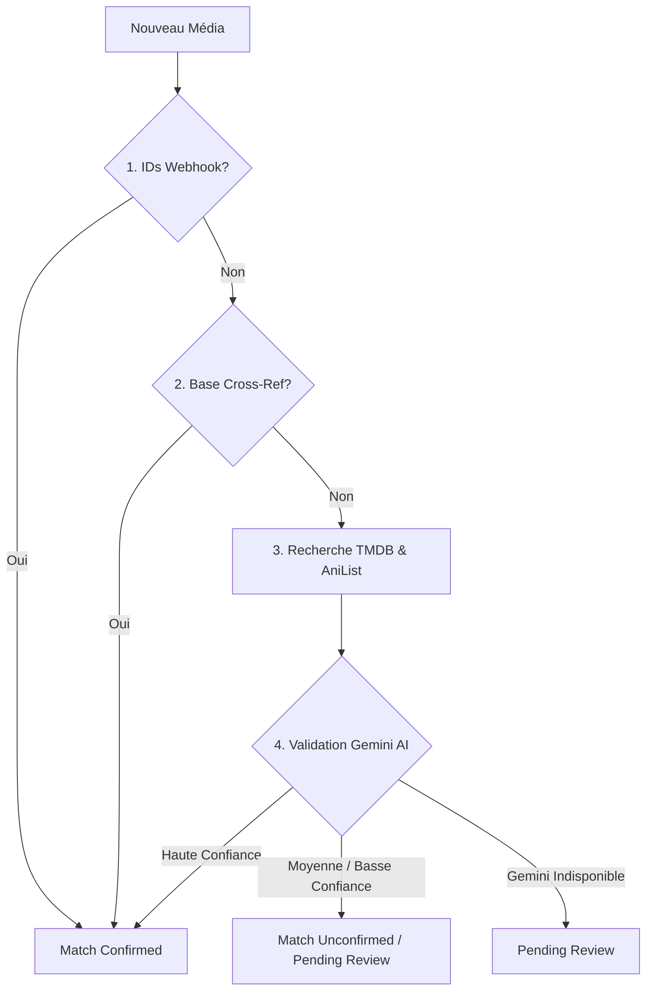

# Tâches de Fond & Automatisation

[← Retour à l'index](INDEX.md)

---

## 1. Rafraîchissement Quotidien des Métadonnées

Une fois par jour, PlexTracker parcourt automatiquement la bibliothèque pour maintenir les données à jour sans intervention utilisateur.

### Périmètre
Titres non terminés (*Watching*, *Plan to watch*) ainsi que les titres présentants des données manquantes (pas de couverture, liste d'épisodes incomplète, statut de série inconnu).

### Actions exécutées par la tâche

| Action | Description |
|---|---|
| **Statut de série** | Vérifie sur TMDB/AniList les changements de statut (ex: en cours → terminée, ou nouvelle saison annoncée). |
| **Nouveaux épisodes** | Récupère les épisodes récemment ajoutés sur TVDB (prioritaire), TMDB ou AniList. |
| **Images de couverture** | Télécharge les visuels manquants depuis TMDB. |
| **Titres multilingues** | Récupère et met à jour les noms en français, anglais et romaji. |
| **Complétion automatique** | Si une série est terminée et que tous les épisodes sont vus, le statut passe automatiquement à *Completed*. |
| **Cross-référence** | Met à jour la base locale de correspondance `anime-offline-database`. |

> **Rate Limiting & Clefs API** : Les appels API sont régulés avec des délais. Pour Gemini AI, les clefs API sont utilisées en rotation pour éviter d'atteindre les quotas.

---

## 2. Pipeline de Matching Média

Lorsqu'un nouveau titre est reçu (webhook Jellyfin ou ajout manuel), le pipeline tente d'associer automatiquement les identifiants externes (TMDB, IMDb, TVDB, AniList) :

1. **IDs Directs** : Si les IDs TMDB/IMDb/TVDB sont fournis par le webhook → Match `confirmed`.
2. **Cross-référence** : Lookup dans la base `anime-offline-database` → Match `confirmed`.
3. **Recherche TMDB / AniList** : Recherche textuelle par titre et année.
4. **Vérification Gemini AI** :
   - Confiance haute + validé → Match `confirmed` automatique.
   - Confiance ambre / échec → Titre placé dans la file **Match Review** (*Pending review* ou *Unconfirmed*).

---

## 3. Outil d'Audit des Saisons (Season Audit)

Accessible dans la section **Admin → Season Audit**.

### Fonctionnement
- Détecte les séries confirmées qui partagent un identifiant externe commun (signe qu'elles représentent des saisons séparées d'une même franchise).
- S'appuie sur les relations AniList et TMDB pour proposer des fusions nommées avec attribution du bon numéro de saison.

### Actions
- **Accept** : Fusionne le titre source dans la destination à la saison suggérée.
- **Dismiss** : Masque définitivement la suggestion.

> Aucune fusion d'audit n'est automatique : toutes nécessitent une validation explicite de l'administrateur.

---

## 4. File de Tâches Asynchrones (Task Queue Worker)

Les opérations lourdes ou dépendantes de services tiers sont exécutées en arrière-plan par un gestionnaire de file de tâches (`TaskQueueWorker`) :

| Type de Tâche | Déclencheur | Action |
|---|---|---|
| `enrichment` | Ajout de titre / Rematch | Exécute le pipeline de matching, récupère les détails TMDB/TVDB et associe les identifiants. |
| `refresh` | Cron quotidien / Enrichissement | Télécharge les épisodes et métadonnées d'une série ou d'un film. |
| `cover_fetch` | Nouveau titre sans visuel | Télécharge la couverture sur le CDN et extrait sa couleur d'accentuation. |
| `anilist_push_season` | Épisode vu / Changement de note | Envoie l'avancement et la note de la saison correspondante à AniList. |
| `anilist_push_movie` | Film vu / Noté | Envoie la complétion et la note du film à AniList. |
| `radarr_push` | Bouton « File Arr » sur un film | Ajoute le film dans Radarr (ou associe l'existant sans écraser ses paramètres) et lance la recherche si nouveau. |
| `sonarr_push` | Bouton « File Arr » sur une série | Ajoute la série dans Sonarr (ou associe l'existante sans écraser ses paramètres) et lance la recherche si nouvelle. |

Les tâches en échec sont consultables et réessayables manuellement depuis **Admin → Tasks** (`/admin/tasks`).
