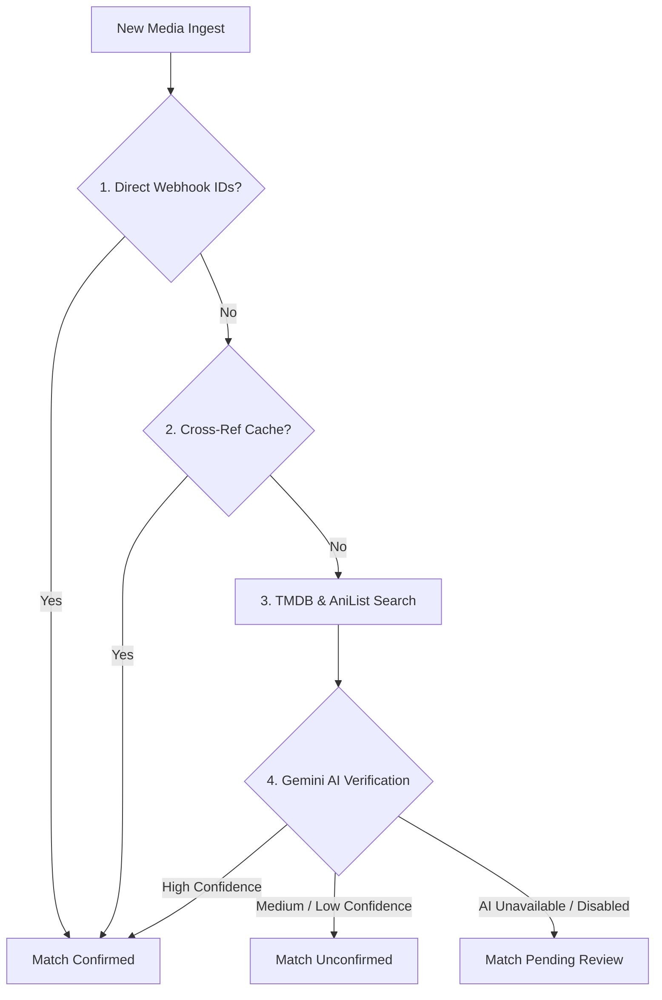

# Background Jobs & Automation

[← Back to Index](INDEX.md)

This document describes Trackarr's internal background workers, scheduler routines, and matching automations.

---

## 1. Daily Metadata Refresh

Trackarr runs an automated daily background worker (internal Go goroutine, no host cron required) to maintain library freshness:

### Scope
Non-completed titles (*Watching*, *Plan to watch*) and any titles with incomplete metadata (missing posters, incomplete episode lists, unknown series status).

### Automated Operations
| Operation | Description |
|---|---|
| **Series Status** | Checks TMDB and AniList for status changes (e.g. *Returning* → *Ended*, new season scheduled). |
| **New Episodes** | Fetches upcoming and recently aired episodes from TVDB, TMDB, or AniList. |
| **Cover Art** | Downloads missing high-resolution posters and extracts dominant accent colors. |
| **Multilingual Names** | Updates aliases in English, French, Japanese, and romaji. |
| **Auto-Completion** | If an ended/cancelled series has all episodes watched, flips status to *Completed*. |
| **Cross-Reference DB** | Updates local `anime-offline-database` cache mappings. |

---

## 2. Media Matching Pipeline

When a media event is received (Jellyfin/Plex webhook, search, or URL import), Trackarr resolves external IDs across providers:

1. **Direct IDs**: If exact TMDB, IMDb, or TVDB IDs are provided by the webhook, match is immediately `confirmed`.
2. **Cross-Reference**: Exact match in `anime-offline-database` cache → `confirmed`.
3. **Provider Search**: Fuzzy search across TMDB and AniList by title and year.
4. **AI Verification (Gemini)**:
   - High confidence validation → auto-`confirmed`.
   - Low confidence, disagreement, or missing AI key → placed in `/admin/match-review` for quick swipe confirmation.

---

## 3. Season Audit Background Scans

The Season Audit service scans for series sharing external IDs (`imdb_id`, `tmdb_id`, `tvdb_id`). It uses a Disjoint-Set Union algorithm to group split franchise entries and suggest 1-click merges with pre-computed season numbers in `/admin/season-audit`.
