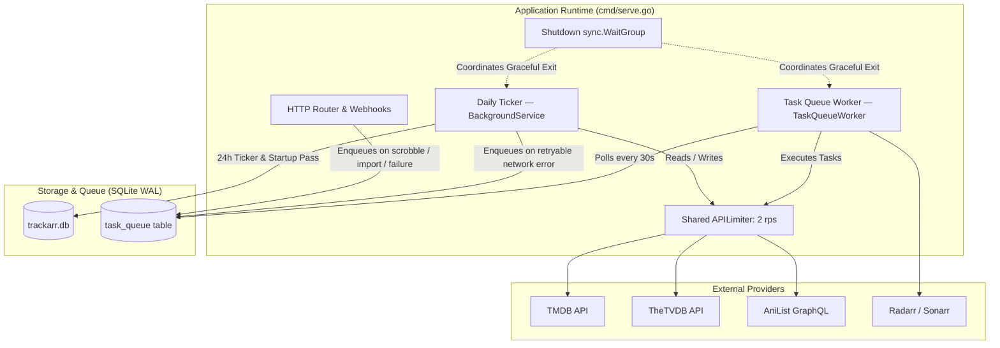
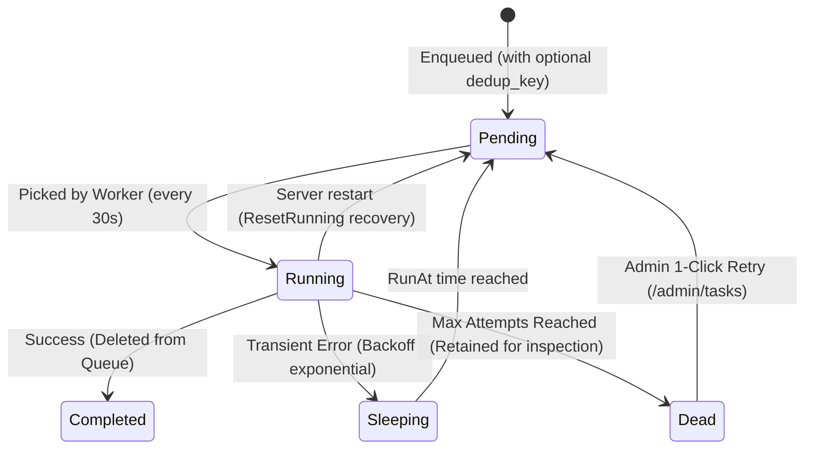

# Background Jobs & Task Queue Architecture

[← Back to Index](INDEX.md)

This document provides a comprehensive specification of Trackarr's background execution engine, scheduled services, and asynchronous task queue.

---

## 🏗️ Architecture Overview

Trackarr employs an entirely self-contained, in-process background execution architecture (no Redis, Celery, or system crons required). It consists of two primary subsystems coordinated under a shared lifecycle:

### Key Architectural Invariants
1. **Shared Rate Limiting (`APILimiter`)**: Background refresh, cover downloads, and task queue workers share a single 2 requests/second token bucket (burst 1) to avoid triggering provider 429 rate limits across parallel goroutines.
2. **Crash-Safe Queue Persistence**: All tasks are stored in SQLite (`task_queue`). Stuck tasks in `running` state are automatically rescued at startup (`ResetRunning`).
3. **Graceful Shutdown (`shutdownWG`)**: On `SIGINT`/`SIGTERM`, the HTTP server shuts down while `cmd/serve.go` awaits in-flight worker iterations (up to 10s timeout) before closing the SQLite database, preventing database-locked panics and half-written transactions.

---

## ⏰ 1. Scheduled Background Service (`Scheduler` & `MetadataSyncService`)

The `Scheduler` (`internal/service/scheduler.go`) orchestrates recurring background cron jobs, while `MetadataSyncService` (`internal/service/background.go`) handles title metadata enrichment and provider synchronization.

### Execution Schedule & Lifecycle
- **Initial Delay**: Waits 30 seconds after server launch before triggering an initial refresh pass (to avoid startup CPU/I/O congestion).
- **Recurrence**: Runs once every 24 hours (`time.NewTicker(24 * time.Hour)`).
- **Panic Recovery**: The outer ticker loop wraps iterations in `recover()`, logging crashes and restarting after 30 seconds to prevent silent goroutine death.

### Automated Operations in Daily Pass

| Step | Operation | Target | Description |
|---|---|---|---|
| **0** | **Cover Fetch** | Missing covers | Scans library for titles without posters and calls `covers.FetchMissingCovers(ctx)`. |
| **1a** | **TMDB Refresh** | Non-completed series/movies | Updates `series_status` (*Ended*, *Returning*, *Canceled*), genres, `next_air_date`, upcoming episode numbers, and syncs season/episode listings. |
| **1b** | **AniList Fallback** | Niche anime (No TMDB ID) | Sourced directly from AniList GraphQL (names, synopsis, genres, score, runtime, cover). |
| **1c** | **TheTVDB Enrichment** | Titles with TVDB link | Fetches community ratings, franchise relations, alternative covers, and cross-references `tvdb_id`. |
| **1d** | **AniList Season Scores** | Anime series | Refreshes per-season community scores and part metadata (`season_external_ids`) via public GraphQL queries. |
| **1e** | **AniList ID Auto-Backfill** | Anime lacking AniList ID | Queries `anime-offline-database` cache and AniList search to associate missing AniList IDs automatically. |
| **1f** | **Multilingual Aliases** | All refreshed titles | Reconciles and synchronizes translations across TMDB, TVDB, and AniList (English, French, Romaji, Japanese). |
| **2a** | **Auto-Completion** | Series in *Watching* / *Plan to Watch* | If a series is marked *Ended* or *Canceled* and all aired episodes are watched, status flips automatically to `completed`. If a *Plan to Watch* series has watched episodes, flips to `watching`. |
| **2b** | **Episode Completion & Watchtime** | Series in `completed` | Enforces that all episodes of completed series are marked `watched` and updates `total_watch_minutes` without creating spurious activity events. |
| **3** | **Weekly Cover Cleanup** | Local disk (`data/covers/`) | Purges orphaned cover image files on disk that no longer match any title in the database (`covers.CleanupUnusedCovers`). |
| **4** | **Failure Enqueueing** | Network errors | If an external API returns a retryable error (e.g. timeout, 5xx), enqueues a `refresh` task in the task queue with deduplication key `refresh:<title_id>`. |

---

## 📥 2. Asynchronous Task Queue (`TaskQueueWorker`)

The `TaskQueueWorker` (`internal/service/taskqueue.go`) processes background jobs stored in the `task_queue` table.

### Task Lifecycle & State Machine

- **Polling Loop**: Every 30 seconds (`time.NewTicker(30 * time.Second)`).
- **Exponential Backoff**: When a task fails with a retryable error, delay increases with jitter up to a 24-hour maximum.
- **Circuit Breaker**: On `429 Too Many Requests`, sets worker-wide pause (`pausedUntil`) preventing API hammering.

### Registered Task Types

| Task Type (`task_type`) | Payload Structure | Description & Triggers |
|---|---|---|
| `enrichment` | `EnrichmentPayload` (`title_id`, `title_name`, `year`, `title_type`, `is_anime`, `imdb_id`, `tmdb_id`, `tvdb_id`, `anilist_id`, `locked_ids`, `preserve_match`) | Runs the full 5-step matching pipeline for a new title (Plex/Jellyfin webhook, manual add, URL import). Respects user-locked external IDs. |
| `refresh` | `RefreshPayload` (`title_id`) | Retries a single-title metadata refresh after a network timeout or rate limit during the daily pass. |
| `cover_fetch` | `CoverFetchPayload` (`title_id`, `tmdb_id`, `anilist_id`, `title_type`) | Downloads high-resolution poster artwork to disk and triggers dominant accent color extraction (`colorextract/`). |
| `anilist_push_season` | `AniListPushSeasonPayload` (`season_id`) | Asynchronously pushes watched episode progress, completion status, and user ratings to AniList GraphQL for anime series seasons. |
| `anilist_push_movie` | `AniListPushMoviePayload` (`title_id`) | Pushes watch status and user rating for anime movies to AniList GraphQL. |
| `radarr_push` | `ArrPushPayload` (`title_id`) | Pushes a movie to the configured Radarr instance download queue with quality profile and root folder settings. |
| `sonarr_push` | `ArrPushPayload` (`title_id`) | Pushes a television series to the configured Sonarr instance download queue. |
| `generate_wrapped` | `GenerateWrappedPayload` (`year`) | Compiles and persists an annual Wrapped snapshot into `wrapped_snapshots` and triggers a Web Push notification (`notif_wrapped_ready`). Automatically enqueued at midnight on January 1st for the past year, or manually triggered from Admin / Stats. |

---

## 🛑 3. Graceful Shutdown Protocol

To avoid SQLite corruption, `database is locked` panics, and orphaned `running` tasks during container restarts or deployments:

1. **Signal Interception**: `cmd/serve.go` captures `os.Interrupt` and `syscall.SIGTERM`.
2. **HTTP Drain**: The HTTP listener stops accepting new connections (`srv.Shutdown` with a 5-second context).
3. **Goroutine Barrier (`shutdownWG`)**:
   - `BackgroundService.StartTicker` decrements the wait group when its current loop concludes.
   - `TaskQueueWorker.Start` decrements the wait group when its current polling pass finishes.
   - Async webhook enrichment routines registered on the wait group finish their database transactions.
4. **Database Close**: `writeDB.Close()` and `readDB.Close()` are called strictly **after** `shutdownWG.Wait()` resolves (or upon a 10-second safety timeout).

---

## 🎛️ 4. Administration & Control

### Web UI Management
- **Task Monitor (`/admin/tasks`)**: View real-time status of pending, sleeping, running, and dead tasks.
- **Dead Task Retry**: Single-click retry button to reschedule dead tasks back to `pending`.
- **Manual Full Refresh (`POST /api/admin/refresh-all`)**: Dispatches a background sweep across the entire media catalog.

### Environment & CLI Flags
- `DISABLE_BACKGROUND_TASKS=true`: Disables both the 24h ticker and the task queue worker loop. Recommended during bulk imports (`trackarr import`) and automated database migrations.
