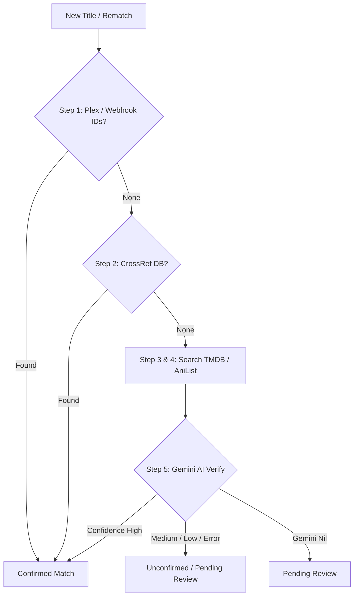

# Matching Pipeline Specification

Technical specification for media identification, external metadata resolution, and AI verification.

## Architecture & Workflow

## Source Files
- Pipeline Coordinator: `internal/service/matching/pipeline.go`
- Strategy Implementations: `internal/service/matching/strategy_*.go`
- External Clients: `internal/service/matching/tmdb*.go`, `tvdb*.go`, `anilist*.go`, `gemini.go`, `crossref.go`
- Task Handler: `internal/service/task_enrichment.go`
- URL Parsing: `internal/service/matching/urls.go`

## Matching Steps

| Step | Strategy | Description | Output Source |
|---|---|---|---|
| 1 | `strategy_plexids.go` | Extracts TMDB/IMDb IDs provided in Jellyfin webhook metadata. | `MatchSourcePlexIDs` (`plex_ids`) |
| 2 | `strategy_crossref.go` | Queries `anime-offline-database` by title/slug. | `MatchSourceCrossRef` (`crossref`) |
| 3 | `strategy_tmdb.go` | Textual search against TMDB by title and release year. | `MatchSourceTMDBSearch` (`tmdb_search`) |
| 4 | `strategy_anilist.go` | GraphQL search against AniList (anime only). | `MatchSourceAniListSearch` (`anilist_search`) |
| 5 | `strategy_gemini_fuzzy.go` | AI fuzzy resolution and verification when search results are ambiguous. | `MatchSourceGeminiFuzzy` (`gemini_fuzzy`) |

## Verification & Auto-Confirm Rules

`verifyAndEnrich` in `pipeline.go`:
- **Confidence Constants**: `ConfidenceHigh`, `ConfidenceMedium`, `ConfidenceLow`.
- **Auto-Confirm Policy (Migration 026+)**:
  - When Gemini returns `ConfidenceHigh` AND `MatchSource` is a search strategy (`tmdb_search`, `anilist_search`, `gemini_fuzzy`) AND `PreserveMatch` is `false`:
    - `match_status = confirmed` directly (bypasses `pending_review`).
    - An audit event row `match_events(kind='auto_confirmed')` is recorded in the same transaction.
  - When Gemini returns `ConfidenceMedium` or `ConfidenceLow`, or errors:
    - `match_status = unconfirmed`.
  - When Gemini client is absent (`p.gemini == nil`):
    - `match_status = pending_review`.

## Metadata Fusion
After ID resolution:
- Parallel fetch: TMDB details (`TMDBClient.GetDetails`) + TVDB details (`TVDBClient.GetSeriesDetails`/`GetMovieDetails`).
- Fusion rules:
  - **Overview**: Longest available text.
  - **Genres**: Union of distinct genre names.
  - **Covers**: Priority order: TMDB > TVDB > AniList.
  - **Origin Country**: TMDB `origin_country` (ISO-3166-1 alpha-2) or AniList `countryOfOrigin`.

## Key Invariants
- **`year` and `release_date`**: Populated **strictly during enrichment** (`buildEnrichmentUpdate` in `task_enrichment.go`), **NEVER** modified during routine refresh (`BackgroundService.refreshTitle`). If a title has `year=0`, trigger a rematch (`POST /api/titles/{id}/rematch`).
- **Seasons creation**: Seasons are created only by refresh (`TaskTypeRefresh` via TMDB) or first watched episode scrobble (`SeasonWriter.GetOrCreate`), never during initial enrichment payload generation.
