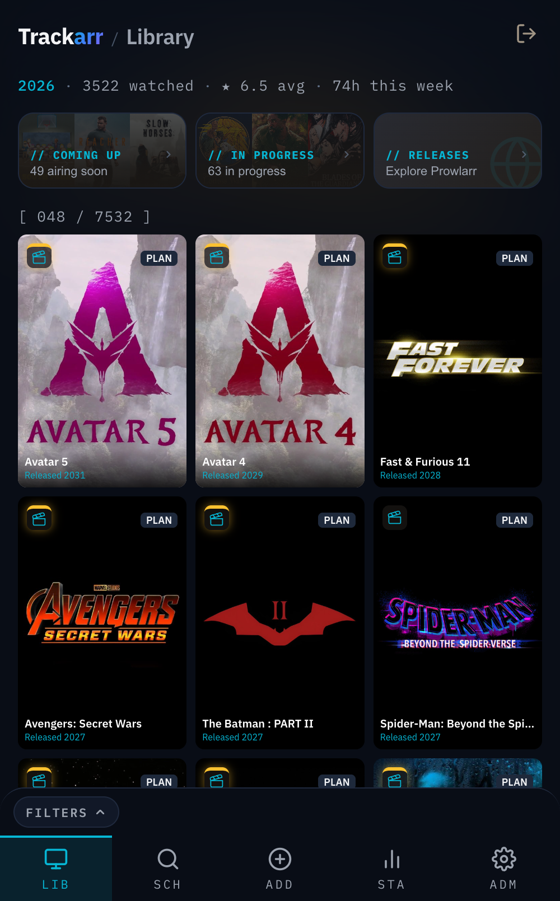
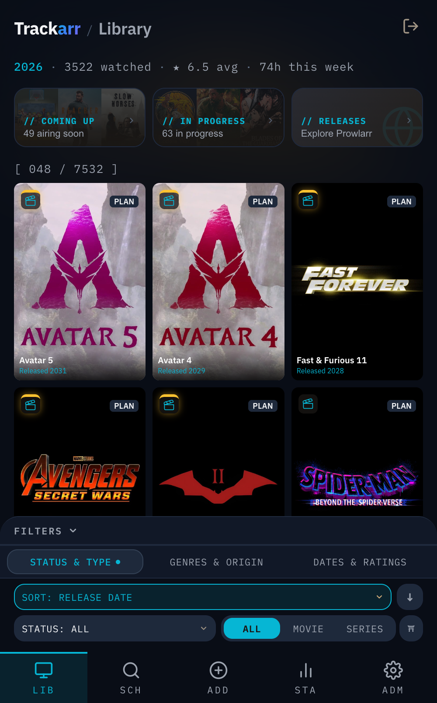
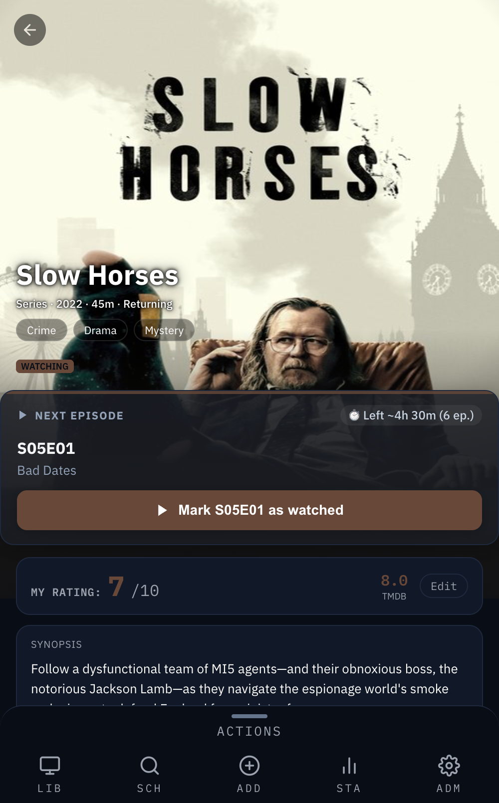
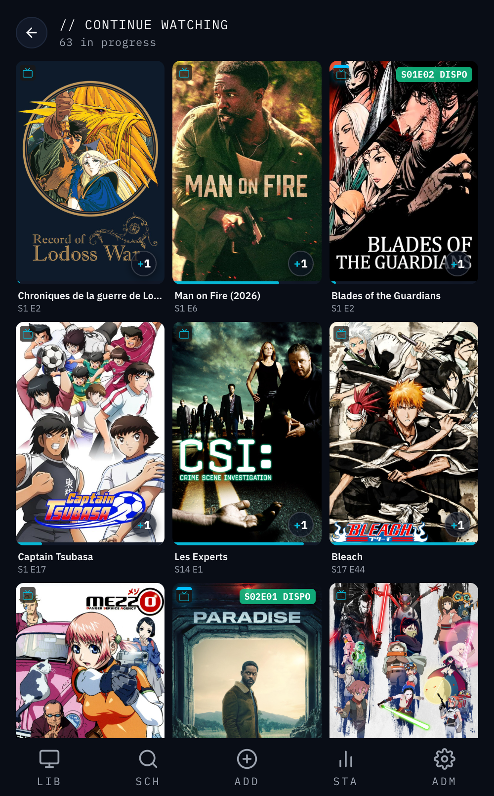
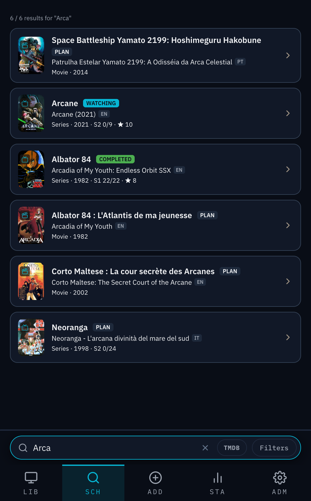
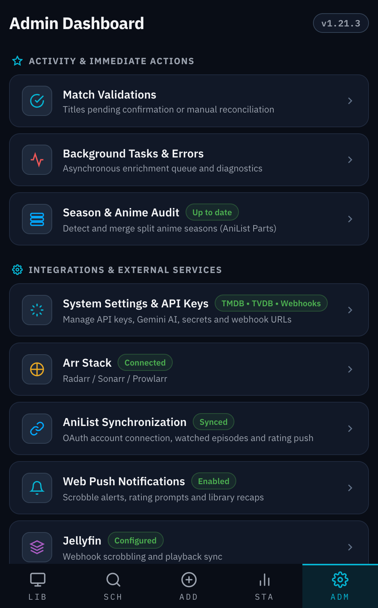

# User Guide & Troubleshooting

[← Back to Index](INDEX.md)

Welcome to the **Trackarr User Guide**. This document explains how to navigate, organize, and get the most out of your personal media tracking vault.

---

## 📑 Table of Contents
1. [Library & Navigation](#1-library--navigation)
   - [1.1. Multi-View Calendar & iCal Export (`/coming-up`)](#11-multi-view-calendar--ical-export-coming-up)
   - [1.2. Stats Insights & Annual Retrospective (`/stats` & `/wrapped`)](#12-stats-insights--annual-retrospective-stats--wrapped)
2. [Managing Titles & Episodes](#2-managing-titles--episodes)
3. [Search, URL Paste & Android Sharing](#3-search-url-paste--android-sharing)
4. [Match Review & Rematching](#4-match-review--rematching)
5. [Season Audit & Title Merges](#5-season-audit--title-merges)
6. [Arr Stack (Radarr, Sonarr, Prowlarr)](#6-arr-stack-radarr-sonarr-prowlarr)
7. [AniList Synchronization](#7-anilist-synchronization)
8. [Comprehensive Q&A & Troubleshooting](#8-comprehensive-qa--troubleshooting)

---

## 1. Library & Navigation

The **Library** screen is your media command center:

<div align="center">
  
  &nbsp;&nbsp;&nbsp;&nbsp;
  
</div>

### Status Categories & Filters:
- **Watching**: Series with at least one aired, unwatched episode.
- **Caught Up**: A special green sub-status badge on watching cards when you have watched every currently aired episode, but future episodes or seasons are scheduled. It automatically flips back to Watching when a new episode airs.
- **Plan to Watch**: Titles you intend to start later.
- **Completed**: Finished movies, or series where every episode has been watched and the series has ended or was cancelled.
- **Dropped**: Abandoned titles.

### Dynamic Views & Stats:
- **Year-to-Date Stats Pill**: Displays your viewing summary under the *Library* header (e.g. `2026 · 47 watched · ★ 7.8 avg · 3h this week`).
- **Dynamic Layout**: Displays a poster grid by default. When filtering by *Watching* or *Caught up*, the view switches automatically to horizontal cards with progress bars and next episode pills.
- **Advanced Filters Drawer**:
  - **Series Status**: Filter series by *Returning* (ongoing), *Ended*, *Cancelled*, or *Not started*.
  - **Origin Country**: Multi-select filter by country of origin (e.g. South Korea, Japan, France, United States).
  - **Rating Sliders**: Dual range sliders for *My rating* (1–10) and *TMDB community rating*.
- **Sorting Options**: 6 sort criteria (Last updated, Title, Release date, Rating, Date added, Last watched). Tap to activate; tap again to invert ascending/descending.

### Gestures & Shortcuts:
- **One-Tap Quick Progress**: In the *Watching* list view, tap the circular episode pill on a series card to immediately mark the next episode as watched without opening the title.
- **Multi-Selection Mode**: Long-press (~500ms) on any card to enter multi-selection mode with haptic feedback. Tap additional cards to select them, then use the bottom action bar for bulk status changes or deletion.
- **Swipe Actions (Match Review)**: Swipe a card left to quickly confirm or fix matches. A full left swipe triggers immediate confirmation.
- **Pull to Refresh**: Pull down at the top of the Library to refresh data and re-evaluate air dates.
- **Android App Shortcuts**: Long-press the Trackarr home screen icon for instant shortcuts to **Add Title** (`/add`), **Library** (`/`), and **Search** (`/search`).

---

## 1.1. Multi-View Calendar & iCal Export (`/coming-up`)

The **Calendar** page (`/coming-up`) provides a complete schedule of upcoming episodes and movie releases for all titles in your watchlist (`watching`, `plan_to_watch`, or returning `completed`):

- **3 Visualisation Modes**:
  - **📅 Monthly Grid (Grille Mois)**: Standard 7-column calendar (Mon–Sun) with month navigation, "Today" highlight, per-day event pills and category color coding (Anime, Series, Movies). Tapping any day opens a rich card overview below the grid.
  - **📆 Weekly Timeline (Semaine)**: 7-day detailed view highlighting day-by-day releases with high-res posters, episode badges (`S02E08`), episode titles, and streaming provider badges.
  - **📋 Classic List (Liste)**: Poster grid sorted chronologically with relative countdown badges (`Today`, `Wed`, `in 5d`) and scroll position restoration.
- **Category Filter Chips**: Quick filtering by *Tous*, *🎬 Films*, *📺 Séries TV*, and *⛩️ Anime*.
- **iCal Subscription Feed (RFC 5545)**:
  - Accessible via the **📅 Flux iCal** button in the header.
  - Generates a personal, token-secured feed (`/api/calendar.ics?token=...`).
  - 1-click subscription buttons for **Apple Calendar** (`webcal://`) and **Google Calendar**.
  - Includes detailed event descriptions (episode number, streaming platforms, status, overview, and direct Trackarr link) with background 6-hour refresh interval.
  - Security option to regenerate and rotate the secret calendar token at any time.

---

## 1.2. Stats Insights & Annual Retrospective (`/stats` & `/wrapped`)

The **Stats** section offers rich analytics and automated annual retrospectives:

### Global Analytics & Filmographies (`/stats`)
- **Key Metrics**: Total watch duration (in hours, days, and real-life comparisons), completed title breakdown, current vs best watch streaks, and genre distribution.
- **Top Actors & Directors**: Dynamic ranking of the top 10 most-watched actors and top 10 directors based on titles in your library and actual watch state.
- **Interactive Filmography Drawer (`PersonFilmographyDrawer`)**: Tapping any actor or director in the stats view opens a slide-up drawer listing all associated titles in your collection, with watch status badges and 1-tap navigation to full filmographies (`/person/:name`).

### Trackarr Wrapped Story Player (`/wrapped`)
- **Immersive Multi-Slide Experience**: 6-slide story player inspired by modern annual reviews, featuring automated progression, dynamic progress bars, pause controls, and touch/keyboard navigation.
  - **Slide 1 (Overview)**: Total watch time with vivid equivalents (days/months/years), discovered titles, scrobbled episodes, average rating, and completion rate.
  - **Slide 2 (Favorites)**: Top 3 titles across Movies, TV Series, and Anime with medal badges and personal ratings.
  - **Slide 3 (Top Releases)**: Highest-rated new releases discovered and watched during the year.
  - **Slide 4 (Rewatch Champion)**: Analysis of true rewatch loops, separating Plex/Jellyfin automatic scrobbles from bulk-marked items.
  - **Slide 5 (Cast & Genres)**: Dominant genres, top actors, and directors of the year.
  - **Slide 6 (Gemini AI Persona)**: Tailored cinephile persona archetype generated by Gemini (title, badges, memorable quote, retrospective summary, and fun trivia facts) with deterministic offline fallback.
- **Immutable Annual Snapshots & Past Archives Gallery**: Past Wrapped summaries are compiled automatically on January 1st (via background task `generate_wrapped`) and stored immutably in SQLite (`wrapped_snapshots`). Browse and replay all previous yearly retrospectives anytime from the **Bilans passés** archive gallery at `/stats`.

---

## 2. Managing Titles & Episodes

<div align="center">
  
  &nbsp;&nbsp;&nbsp;&nbsp;
  
</div>

Opening a title displays its rich details:
- **Hero & Accent Color**: High-resolution cover art with dynamic backdrop gradient extracted from poster colors.
- **Next Episode Action & Binge Estimator**: A prominent call-to-action hero card right under the title identity allowing 1-click progression (`▶ Marquer S02E06 comme vu`) without unfolding season lists. Includes real-time binge estimation (*« ⏱️ Reste ~3h 15m (4 épisodes) »* or total duration for Plan to Watch titles).
- **Personal Notes (Notes personnelles)**: A private notes card on every title with debounced auto-save (500ms) to jot down reminders, personal reviews, quotes, or recommendations.
- **Streaming Badges**: Displays multi-provider streaming badges (Netflix, Amazon Prime Video, Disney+, Apple TV+, Max, Canal+, Crunchyroll, Paramount+, ADN) when the title is available on active subscription platforms configured in *Admin ➔ System Settings*.
- **Conditional Direct Rating Card**:
  - **Unrated Title**: A responsive 1-tap touch strip of buttons (`1` to `10`) is displayed directly on the rating card for instant scoring without opening a drawer, automatically syncing with AniList in the background.
  - **Rated Title**: Displays a clean, prominent rating (`MY RATING: 8/10`) alongside community ratings (TMDB, AniList) and an *« Edit »* button to open the rating bottom sheet for modifications or IMDb sync.
- **Cast & Crew**: List of actors and directors with their roles. Tapping a name opens their **Person** view, listing all matching titles present in your Trackarr library.
- **Media Management & History**: Add and last watched dates, cumulative watch time, original title, and grouped watch history sessions (e.g. `S1 E1–4 · Apr 12`).
- **Seasons & Episodes**: Expand seasons, toggle episodes with one click, view air dates and episode synopses.
- **Sagas, Universes & Franchise Tracker**: Dedicated module surfacing related works for movies (TMDB collections like *Marvel Cinematic Universe*, *Harry Potter*, *Star Wars*, *Dune*), TV series (TheTVDB franchises like *Breaking Bad* / *Better Call Saul*), and animes (AniList side stories & movies):
  - **Saga Progress**: Global completion gauge based on titles (*« 24 / 34 Titles seen »*) with a linear progress bar.
  - **Next Chronological Title**: Highlighted indicator identifying the next unwatched chronological title to watch in the franchise (or completion message when 100% watched).
  - **Horizontal Titles Strip**: Scrollable timeline chip strip with hidden scrollbar (`scrollbar-width: none`), seen checkmarks (`✓`), next highlight (`▶`), and 1-tap navigation.
  - **Detailed Relations Grid**: Sorting toggle (⏱️ Timeline vs 📅 Release), category filters (*Movies*, *Series*, *OVAs*, *Spin-offs*), collapse/expand toggle, local library status badges (`✓ Watched`, `Plan to Watch`), and a 1-click `[+ Add]` button for missing titles.
- **AniList Season Strip**: Per-season community scores and direct ✎ link editor for anime seasons (including split *Part 1 / Part 2* entries). Clicking **Link entry** or ✎ opens the season linker with instant in-app AniList search (with posters, media format, episode count, and 1-click linking) plus a direct *Search on AniList.co ↗* browser shortcut.
- **Actions Drawer**:
  - **Rate**: Set personal 1–10 star score.
  - **Edit**: Modify title type (Movie/Series), anime flag, or watch status.
  - **More**: Send to Radarr/Sonarr (File Arr), Rematch, Merge into another title, Refresh Metadata, or Delete.
  - **External Links**: Instant shortcuts to IMDb, TMDB, TVDB, and AniList.
- **Rating Push Notification**: Sends an optional Web Push notification prompting to rate a movie or completed series after finishing it (configurable in *Admin ➔ Notifications*).

---

## 3. Search, URL Paste & Android Sharing

<div align="center">
  
</div>

Adding media to Trackarr is fast and versatile:
1. **Search by Name**: Search instantly across your local library (with full-text search) or query TMDB for new titles to add.
2. **Direct URL Paste**: Paste an IMDb (`https://imdb.com/title/tt...`), TMDB (`https://themoviedb.org/movie/...`), TVDB (`https://thetvdb.com/series/...`), or AniList (`https://anilist.co/anime/...`) link into the search bar to import the exact entry.
3. **Native Mobile Share**: Trackarr registers as a Web Share Target on Android and iOS. Share a title link directly from your browser or streaming app into Trackarr.

> [!TIP]
> **Fast-Track Mobile Addition Workflow**:
> When finding a title on your phone (e.g. from the IMDb or TMDB app):
> 1. Tap **Share ➔ Trackarr** (import creates the title entry).
> 2. Open the title sheet ➔ **Actions ➔ More ➔ Rematch** ➔ search & confirm the match.
> 3. Tap **Actions ➔ More ➔ Refresh Metadata** to pull high-res covers, full season/episode trees, and air dates immediately.

---

## 4. Match Review & Rematching

When Trackarr ingests a scrobble from Jellyfin/Plex or an imported title:
- **High-Confidence Matches**: Auto-confirmed by AI (Gemini) or exact cross-reference IDs, bypassing manual review.
- **Unconfirmed / Pending Review**: Placed in the **Match Review** queue (`/match-review`) for quick human verification.
- **Rematch**: Open any title ➔ **Actions (Bottom Bar) ➔ More ➔ Rematch** to re-link or paste a new URL.

---

## 5. Season Audit & Title Merges

Anime and split TV seasons frequently release under separate titles (e.g. *JoJo's Bizarre Adventure: Stone Ocean* or *Frieren Season 2*).

- **Season Audit Tool (`/admin/season-audit`)**: Scans for titles sharing external IDs, pairs source strays with parent series, displays side-by-side poster comparisons, and suggests the correct destination season number.
- **Manual Title Merge**: Open the title to discard ➔ **Actions ➔ More ➔ Merge** ➔ Search the destination parent title ➔ Choose destination season number. All episodes, watch timestamps, and ratings migrate seamlessly.

---

## 6. Arr Stack (Radarr, Sonarr, Prowlarr)

<div align="center">
  
</div>

Trackarr bridges media tracking with your download managers:
- **Visual Status Lines (Liserés)**:
  - **Yellow top border**: Movie is tracked in **Radarr**.
  - **Cyan top border**: Series is tracked in **Sonarr**.
- **Arr Icon Badges**: 18px indicator pills on search and list cards showing Radarr target or Sonarr waveform.
- **Direct Arr Push**: Send titles directly to Radarr or Sonarr from the title detail sheet (**Actions ➔ More ➔ Send to Radarr/Sonarr**), with defaults configurable at `/admin/arr`.
- **Prowlarr Releases**: Access incoming releases on `/releases` with multi-indexer filtering, year filtering, and 1-click **+ Add** to Trackarr.

---

## 7. AniList Synchronization

When AniList OAuth is connected:
- **Automatic Push**: Episode watch events, status changes, and ratings push to AniList in the background.
- **Multi-Part & Prequel Trees**: Trackarr automatically maps multi-part seasons (e.g. *Attack on Titan Final Season*) to individual AniList media entries using its internal season parts resolver.
- **Season AniList Strip & Live Search**: View community scores per season and re-link specific anime entries with the ✎ button or *Link entry*. The season mapping sheet instantly searches AniList in the background using the series title, displaying rich result cards (poster, Romaji/English title, format, year, episode count) that can be linked in a single tap, alongside a *Search on AniList.co ↗* browser shortcut and manual ID fallback.

---

## 8. Comprehensive Q&A & Troubleshooting

### Why didn't my anime score push to AniList?
> **Answer**: AniList's API strictly rejects rating scores on anime entries whose status is still *Current/Watching*. Trackarr automatically holds the score and sends it the moment the anime status flips to **Completed** or **Dropped**.

### How does Trackarr handle split seasons like "Solo Leveling Season 2"?
> **Answer**: Trackarr queries AniList relations to trace prequel/sequel edges back to the root series. When confirmed, it automatically attaches the new entry as Season 2 of the parent series rather than creating a duplicate standalone show.

### Why do some cards show "CAUGHT UP" instead of "WATCHING"?
> **Answer**: "Caught Up" is an intelligent sub-state of Watching. It indicates that you have watched all episodes that have aired up to today, while future episodes are still scheduled. When a new episode airs, the card seamlessly transitions back to "WATCHING".

### What if TMDB and TVDB disagree on external IDs?
> **Answer**: Trackarr's matching pipeline prioritizes TMDB as the primary source of truth, falls back to TVDB, and flags the item as **Pending Review** in Match Review so you can verify the match instead of silently accepting conflicting data.

### How do I reset my password if I lose access?
> **Answer**: Trackarr provides two recovery methods:
> 1. **From the Browser (Emergency Recovery Key)**: On the login screen (`/login`), click **"Forgot password?"**, enter the `TRCK-XXXX-XXXX-XXXX` emergency recovery key saved during initial setup, and set a new password. Trackarr will issue a new recovery key.
> 2. **From the Terminal (CLI)**: Run the built-in command in your container or host:
>    ```bash
>    docker exec -t trackarr trackarr reset-password --password="MyNewSecurePassword"
>    ```
>    *(Omit `--password` to enter it interactively. A new emergency recovery key is displayed upon completion).*

### Why is the PWA showing older assets after an update?
> **Answer**: Service Workers aggressively cache web app bundles for instant offline access. Hard-refresh the page (or append `?t=1234` to the URL) to let the service worker install the new version.

### What causes a "database table is locked" error in logs?
> **Answer**: SQLite in WAL mode allows unlimited concurrent readers but only one active writer (`MaxOpenConns=1`). Trackarr handles transactions with automatic retry and short timeouts. Ensure custom external tools do not lock the SQLite database file during runtime.

### Can duplicate scrobbles occur if Jellyfin and Plex send simultaneous webhooks?
> **Answer**: No. Trackarr computes an event fingerprint (media ID + title + timestamp window) and discards duplicate scrobble events received within a short threshold.
